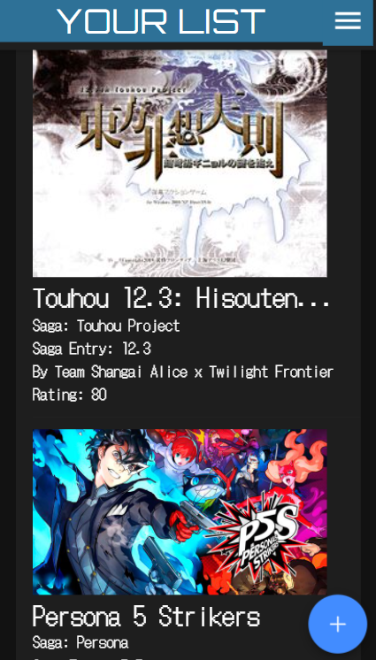
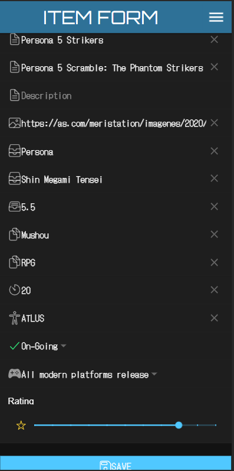

# PendingEntertainmentListFB

As its name says, this app will allow you to access to a simple yet complete list about those audiovisual entertainment that you haven't been able to complete yet (because of work or other things you had to do), but want to complete in the future. Here is a little preview of what you will find:

## FIRST SCREEN: LOGIN

The first thing you'll see when opening the app will be a typical login screen with the password recovery and register options.

### REGISTER USER AND PASSWORD RECOVERY

Within the login screen, you can be redirected either to registering yourself with an e-mail account or to reset your password if you have forgotten It.

## LIST SCREEN

Once you have logged in, you will have access to the list itself, where you can delete or edit the items you have registered. For now you can only add videogames, but in later updates there will be possible to add books and series.

 

### ITEM OPTIONS

By sliding your finger right to left, you will have access to the options of every item you have already registered.

## EDIT SCREEN

To add or edit an item, you will be redirected to the same page, with the only diference of the information already added when editing an item.

