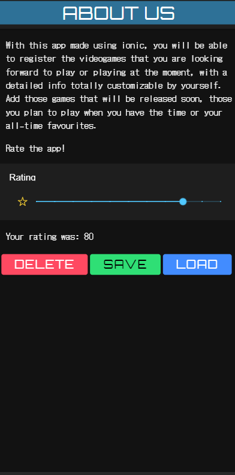

# PendingEntertainmentListFB

As its name says, this app will allow you to access to a simple yet complete list about those audiovisual entertainment that you haven't been able to complete yet (because of work or other things you had to do), but want to complete in the future. Here is a little preview of what you will find:

## FIRST SCREEN: LOGIN

The first thing you'll see when opening the app will be a typical login screen with the password recovery and register options.

<table>
  <tr>
    <td>Login Screen</td>
  </tr>
  <tr>
    <td></td>
  </tr>
</table>

### REGISTER USER AND PASSWORD RECOVERY

Within the login screen, you can be redirected either to registering yourself with an e-mail account or to reset your password if you have forgotten It.

<table>
  <tr>
    <td>New User Screen</td>
    <td>Recovery Screen</td>
  </tr>
  <tr>
    <td></td>
    <td></td>
  </tr>
</table>

## LIST SCREEN

Once you have logged in, you will have access to the list itself, where you can delete or edit the items you have registered. You can add videogames, books and series.

<table>
  <tr>
    <td>List Screen</td>
  </tr>
  <tr>
    <td>
      
    </td>
  </tr>
</table>

### ITEM OPTIONS

By sliding your finger right to left, you will have access to the options of every item you have already registered.

<table>
  <tr>
    <td>List Screen (Options)</td>
  </tr>
  <tr>
    <td>
      
    </td>
  </tr>
</table>

## EDIT SCREEN

To add or edit an item, you will be redirected to the same page, with the only diference of the information already added when editing an item. Every type of item (videogames, animes or books) has a block of input options that will change depending on the type of item you choose.

<table>
  <tr>
    <td>Game Edit Screen</td>
    <td>Anime Edit Screen</td>
    <td>BookEdit Screen</td>
  </tr>
  <tr>
    <td>
      
    </td>
    <td>
      
    </td>
    <td>
      
    </td>
  </tr>
</table>

## INFO SCREEN

In the sliding menu, you can access the info page of the app, where you can read a short description of the functionality of the app and a rating function to rate the app itself made using Ionic Local Storage

<table>
  <tr>
    <td>Info Screen</td>
  </tr>
  <tr>
    <td>
      
    </td>
  </tr>
</table>

